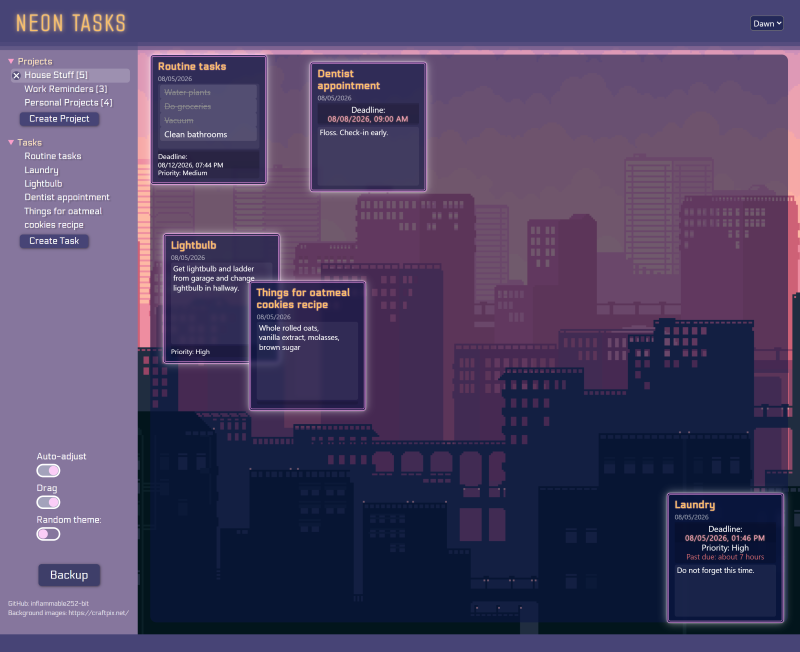
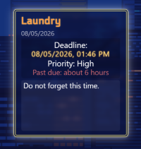
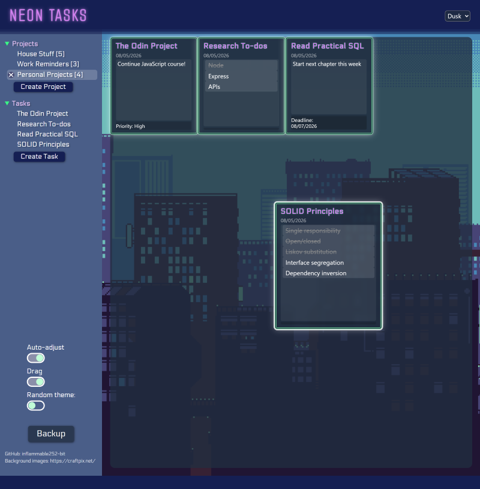
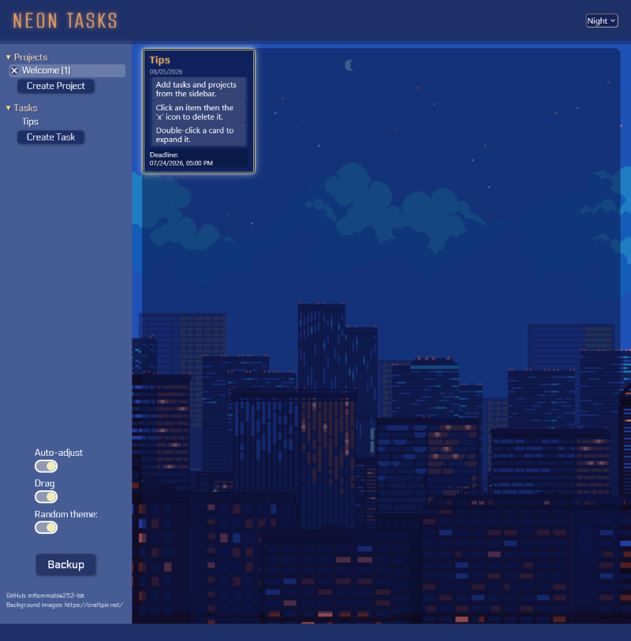
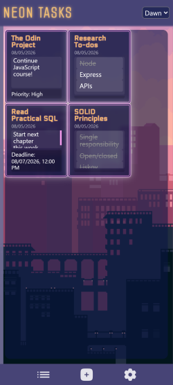

# Neon Tasks

A browser-based to-do list created in vanilla JavaScript and bundled with Webpack. The focus of this project was to integrate localStorage methods with CRUD operations in a user interface. Draggable cards, an open layout, and detailed themes are used to make an engaging and intuitive experience for the user.

Created as part of the JavaScript course of The Odin Project.

## Features
- Create three types of notes to emphasize different items
    - Cross items off with a Checklist note
    - Track a live due date timer with Date notes
- Move draggable notes
- Swap between projects, saving different sets of notes
- Copy or paste a backup string
- Switch between three page themes

## Methods
A projectsList array holds Project objects. Each Project has a taskList array and creates tasks via functions that refer to its addTaskToList() method.
Tasks are instances of the Note class and its child classes. This allows each task to have methods that update its properties or begin the populateCard() function. Child classes also additional properties, such as an array for checklist item status or the visibility of a timer. A timestamp is generated for each new card and a due date may be input by the user. In a Date note, the user may select an optional timer to be displayed on the card. If selected, the task object and the timer element are stored in an array. The difference between the due date and the current time is calculated intermittently and updates each timer in that array. Formatting and calculations related to time are extensively facilitated by date-fns.

*Date card with an active timer*

Each card is passed event listeners, adapted from [Ayushmaan Srivastav](https://srivastavayushmaan1347.medium.com/blog-title-creating-a-draggable-div-element-with-javascript-88f3be51bbf9), to enable dragging. Card positions are also processed and stored on click to maintain their relative locations on window size changes, or to keep the cards in the cardWrapper container. Both drag and auto-adjust can be toggled off. Internal checks prevent existing cards from being dragged or adjusted if the corresponding setting is toggled off.

Buttons in the sidebar open a context-sensitive modal window that will generate the appropriate form based on the id of the click target. To delete an item, the index of the item is also retrieved to update both the projectsList array and the UI accordingly.

A backup feature can be accessed through a button in the sidebar. A string is generated from localStorage. Users are directed to either copy this string, displayed in a text box, or paste an existing string. Applying a backup requires holding the "Apply" button for three seconds. Projects, tasks, and settings are saved continually as CRUD-related functions or toggle functions are called.

## Preview Images

## Possible Features
- More card types
- Card categories/tagging
- Alternative layout for mobile, as the card structure currently does not work well for smaller viewports
- Other modules, ex. stopwatch/Pomodoro timer
- Maintain card positions on reload
- Card resizing
- Modal window to edit a selected card
- Smoother drag behavior
- Buttons to sort cards into different arrangements

## Other
Background image credits: https://craftpix.net/